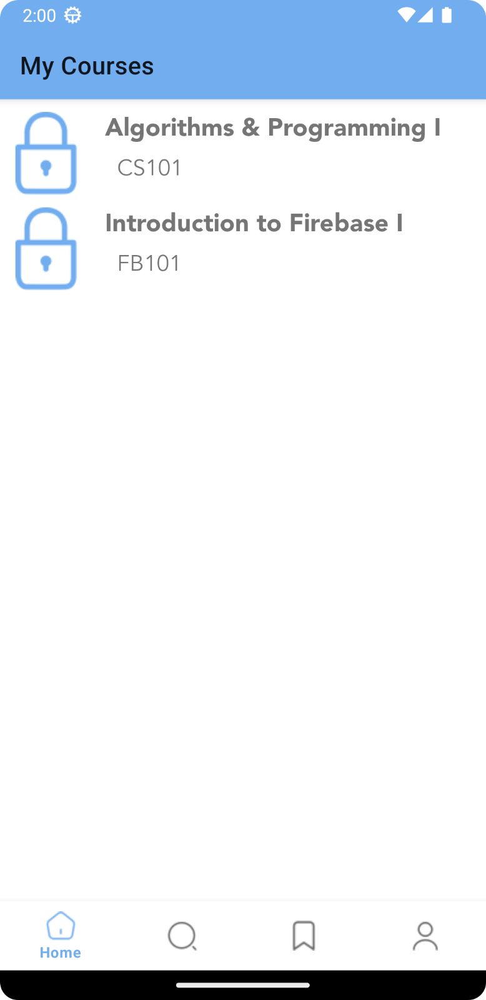
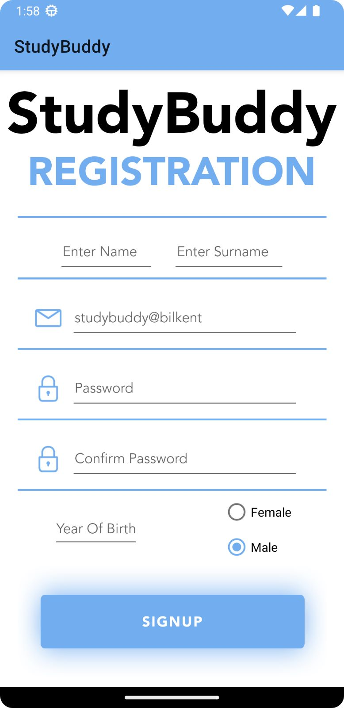
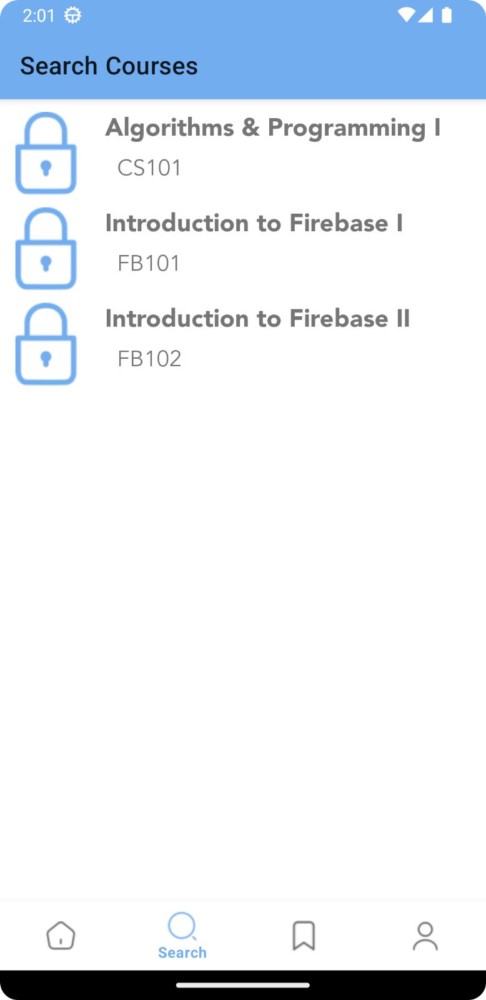
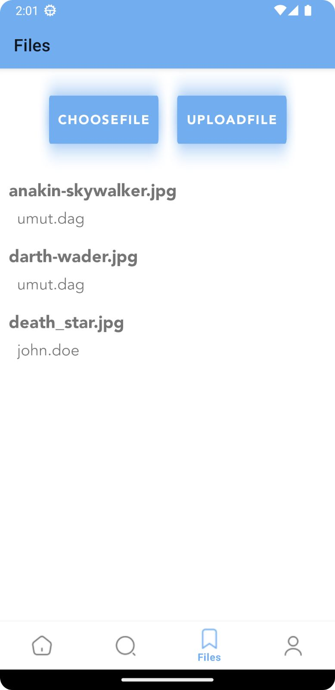
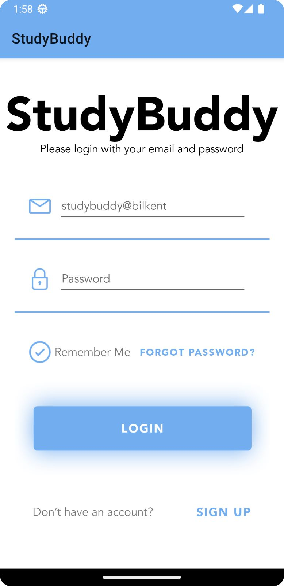
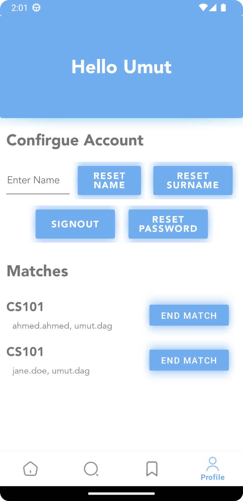
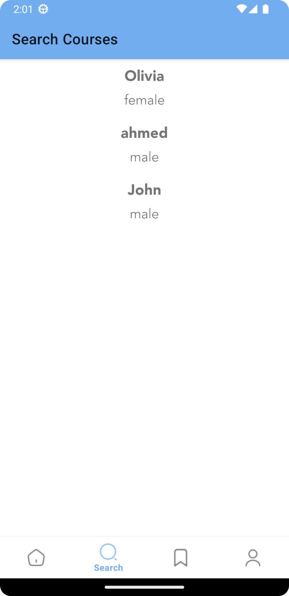
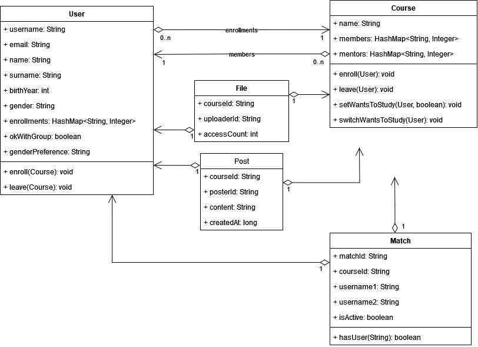

 

  

  <h3 align="center">StudyBuddy</h3>

  

    Do not study alone in Bilkent, get a StudyBuddy
  

 

## Table Of Contents

* [About the Project](#about-the-project)
* [Built With](#built-with)
* [Authors](#authors)

## Screenshots

## About The Project
Communication between students increases the studying efficiency and mental health to high levels. This project aims to help ease the process of finding your study buddy. StudyBuddy will try to eliminate all the hassle and time waste in this process by integrating the app into the stu-dent’s study life. The app will quickly locate a partner who is studying the same course, organize a meeting location and time in a matter of seconds, and track their course progress. Once a student opts-in to try StudyBuddy, they will regard its positive effects on their schedules. StudyBuddy also provide security measures that ensures the safety of all users at all times. Finally, the app supports Android 10 API Level 29

## Built With

The app’s features were implemented by using a collection of tools and programs:
The app was built for the Android platform by using Android Studio or Intellij, and the main programming language is Java. 
Xml files were to create layouts for the application. 
The user authentication system and databases which includes usernames, passwords, progress points, and course list and details were managed by Google’s Firebase. 
The course list will be scraped from Bilkent’s course offerings site and stored on the database. 
The chat and forums were implemented on the same Firebase Storage account.

### Class Diagram

## Authors

* **Ahmed Ibrahim Elsayed** - 0ne83 - [Profile](https://github.com/0ne83)
* **Umut Dağ** - *umtdg* - [Profile](https://github.com/umtdg)

